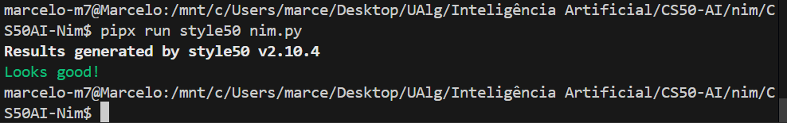
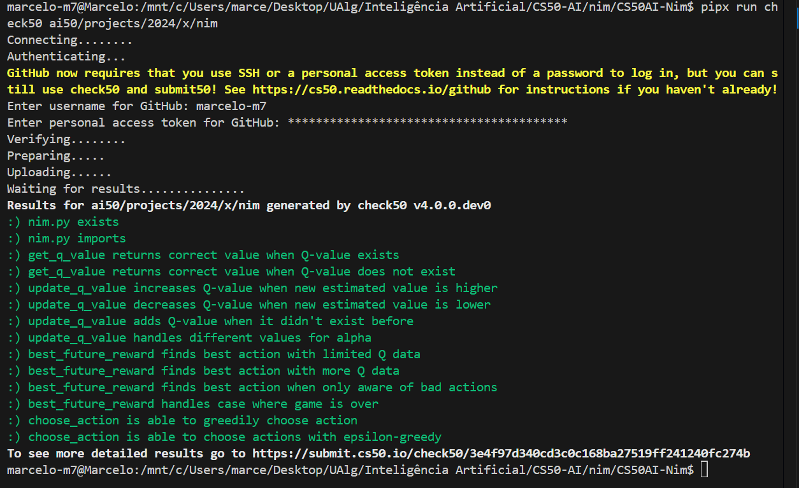
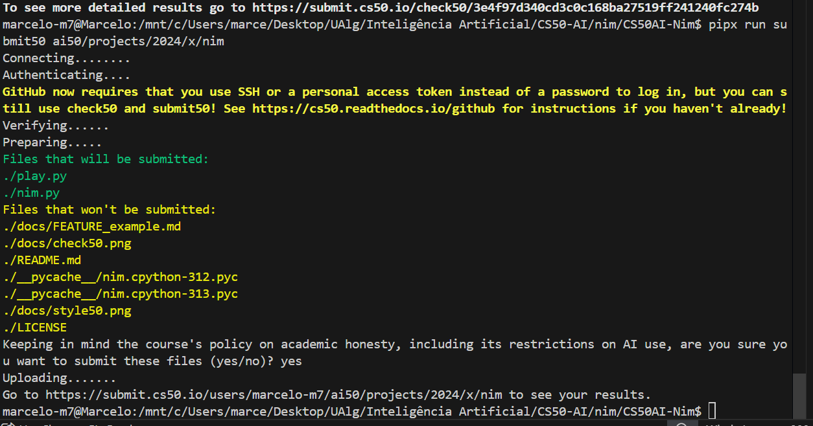

# 🧠 Agente de Q-Learning para o Jogo Nim

**Aluno:** Marcelo Santos (a79433)
**Curso:** Engenharia de Sistemas e Tecnologias Informáticas — Universidade do Algarve
**Unidade Curricular:** Inteligência Artificial

Este projeto tem como objetivo implementar um agente inteligente capaz de aprender autonomamente a jogar o jogo **Nim**, recorrendo a **aprendizagem por reforço** com a técnica de **Q-learning**.

---

## Objetivo Geral

Criar uma inteligência artificial baseada em **aprendizagem por reforço** (*Reinforcement Learning*), utilizando a técnica de **Q-learning**, para que o agente aprenda estratégias vencedoras no jogo Nim jogando repetidamente contra si mesmo.

---

## O Jogo Nim — Problema a Resolver

O Nim consiste em vários montes, cada um com um número de objetos.
Em cada jogada:

* O jogador escolhe **um único monte**
* Retira **quantos objetos quiser** desse monte

**Perde quem retirar o último objeto.**

Apesar da simplicidade, a combinação de múltiplos montes produz um espaço de estados grande, tornando o problema ideal para técnicas de aprendizagem por reforço.

---

## Arquitetura da Solução

O projeto é composto por dois ficheiros principais:

* **`nim.py`** — implementação do jogo e do agente Q-learning
* **`play.py`** — interface para treino e jogo humano

### Funções-chave implementadas (resumo)

#### `get_q_value(state, action)`

* Retorna o valor Q associado ao par `(estado, ação)`.
* Devolve `0.0` caso ainda não exista Q registado.

#### `update_q_value(state, action, old_q, reward, future_rewards)`

* Aplica a fórmula do Q-learning.
* Atualiza a tabela Q interna (`self.q`).
* Inclui logs úteis para debug.

#### `best_future_reward(state)`

* Calcula o maior Q possível entre todas as ações válidas naquele estado.
* Retorna `0.0` se não existirem valores Q registados.

#### `choose_action(state, epsilon=True)`

* Implementa a política **ε-greedy**:

  * Com probabilidade ε, escolhe ação aleatória.
  * Caso contrário, escolhe a ação com maior valor Q.

---

## Resultados Preliminares do Treino

Treino rápido utilizado:

```bash
python3 -c "from nim import train; train(10)"
```

Observações do log:

* No início, quase todos os `best_future_reward` são `0.0` (tabela Q vazia).
* Com algumas iterações, surgem valores positivos crescentes (`0.25`, `0.5`, `0.75`, `0.875`) — o agente reforça decisões boas.
* Surgem também valores negativos (`-0.5`, `-0.75`, `-0.96875`) — punições propagadas de jogadas que levaram à derrota.
* A tabela Q começa a ganhar forma, distinguindo movimentos vantajosos dos prejudiciais.

**Interpretação:** o agente demonstra sinais claros de aprendizagem — após mais jogos, espera-se estabilização das estratégias.

---

## Componentes Implementados

### 1. **Classe `Nim`**

* Representa o estado do jogo.
* Gera ações válidas.
* Aplica jogadas e alterna turnos.

### 2. **Classe `NimAI`**

* Geração e atualização de valores Q.
* Estimativa de recompensas futuras.
* Seleção de ações com política ε-greedy.

### 3. **Treino e Jogo**

* Treino autónomo (self-play).
* Possibilidade de jogar contra o agente após treino.

---

## Metodologia (Q-Learning)

O agente segue a atualização:

```
Q(s,a) ← old_q + α * ((reward + future_reward) − old_q)
```

Onde:

* **s** = estado atual
* **a** = ação tomada
* **α** = taxa de aprendizagem
* **reward** = recompensa imediata
* **future_reward** = melhor Q futuro possível

Com repetição suficiente, o agente ajusta os seus Q-values até convergir para uma política estável.

---

## Como Utilizar

### Treino

```bash
python nim.py
```

### Jogo humano vs agente

```bash
python play.py
```

### Treino rápido para inspeção

```bash
python -c "from nim import train; train(10)"
```

### Ambiente virtual (opcional)

```bash
python -m venv venv
```

---

## Ferramentas e Técnicas

* Python 3.12
* Algoritmo **Q-learning**
* Política **ε-greedy**
* Testes automáticos com CS50 (`check50`, `style50`, `submit50`)
* Git e documentação estruturada

---

## Melhorias Futuras (Features Planeadas)

1. Persistência da tabela Q (`pickle`) para evitar re-treino completo.
2. Experimentos com diferentes hiperparâmetros (α, ε, nº de jogos) incluindo registo de win-rate.
3. Testes unitários para funções essenciais (`get_q_value`, `update_q_value`, `choose_action`, etc.).

---

## Verificações







---

## 🔗 Referências

- [Nim – CS50's Introduction to AI](https://cs50.harvard.edu/ai/projects/4/nim/)
- [Neural Networks – Lecture 5 (CS50 AI 2020)](https://youtu.be/J1QD9hLDEDY?si=41EOOXi-BaDbVy5E)

---

**Universidade do Algarve — Departamento de Engenharia Eletrotécnica e Informática**
*2025*

---
